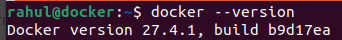
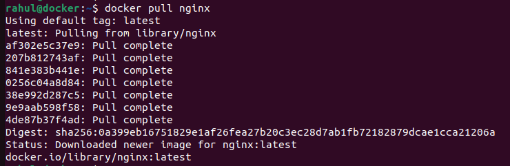
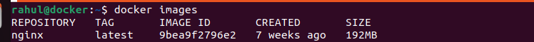
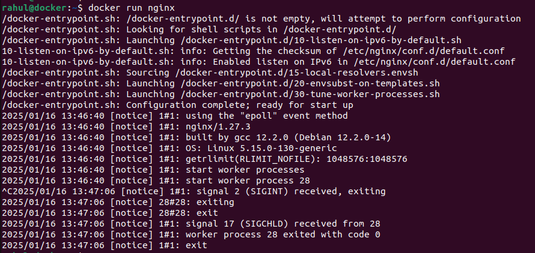

### This document provides an overview of basic Docker commands with examples to help you get started.

## Prerequisites
- Install Docker from [Docker's official website](https://www.docker.com/).
- Ensure Docker is running by executing:

### 1. Check Docker Version

```bash
docker --version
```
## Example Output:




### 2. Pull an Image Download an image from Docker Hub.

```bash
docker pull <image_name>
```
## Example Output:




### 3. List Images Display all downloaded images.

```bash
docker images
```
## Example Output:




### 4. Run a Container Run a container from an image.

```bash
docker run <image_name>
```
## Example Output:




### 5. Run a Container in Detached Mode Run a container in the background.

```bash
docker run -d <image_name>
```
## Example Output:


### 6. List Running Containers View all active containers.

```bash
docker ps
```

### 7. Stop a Container Stop a running container by its `container_id` or `name`.

```bash
docker stop <container_id>
```
## Example Output:

```bash
docker stop 123abc456def
```

### 8. emove a Container Remove a stopped container.

```bash
docker rm <container_id>
```
## Example Output:

```bash
docker rm 123abc456def
```

### 9. Remove an Image Delete an unused image.

```bash
docker rmi <image_id>
```

## Example Output:

```bash
docker rmi 4bbc3c0b4814
```

### 10. View Logs of a Container Check the logs of a running or stopped container.

```bash
docker logs <container_id>
```
## Example Output:

```bash
docker logs 123abc456def
```

### 11. Execute a Command in a Running Container Access the container's shell or run commands inside it.

```bash
docker exec -it <container_id> <command>
```
## Example Output:
```bash
docker exec -it 123abc456def bash
```

### 12. Stop All Running Containers Stop all active containers at once.

```bash
docker stop $(docker ps -q)
```

### 13. Remove All Containers Delete all stopped containers.

```bash
docker rm $(docker ps -a -q)
```

### 14. Remove All Images Delete all Docker images.

```bash
docker rmi $(docker images -q)
```
